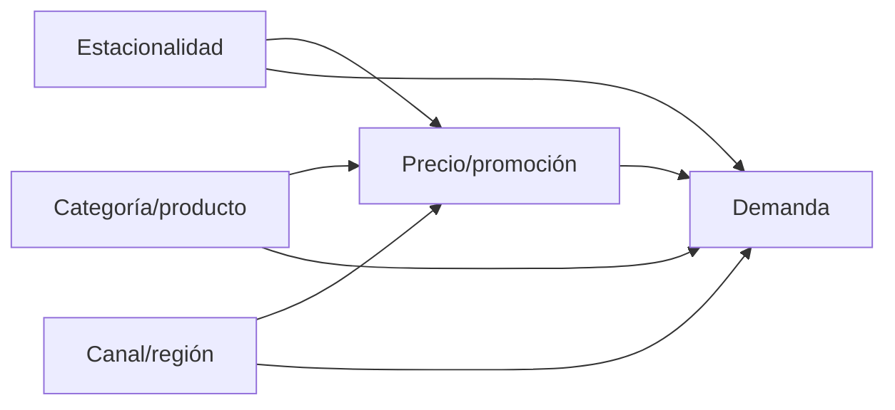

# DAG de precio, promoción y demanda

La pregunta es el efecto de una variación de precio sobre unidades. Estacionalidad,
categoría y canal abren caminos de confusión y deben controlarse. La promoción está
estrechamente ligada al precio; se incluye para separar su comunicación del descuento.

El modelo observacional no resuelve toda endogeneidad: precios pueden responder a
información de demanda no observada. Por eso la recomendación final prioriza un A/B
test cuando sea operacionalmente posible y utiliza elasticidad como evidencia
condicionada, no como verdad causal absoluta.
